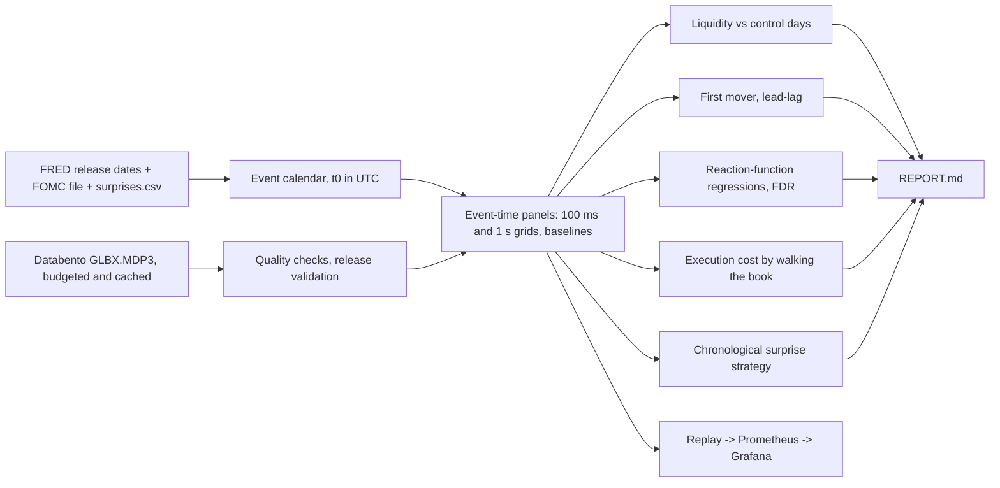

# Print Time

Print Time measures how CME futures order books thin out, reprice and recover around CPI, payrolls and FOMC releases, and turns that into a clear answer to when it's safe to trade again and what it costs.

[](https://github.com/Hijanhv/printtime/actions/workflows/ci.yml)

> **Status: the research system is built and tested end to end; there are no market results yet.** Every phase of the spec is implemented and checked against a synthetic generator whose answers are known. Real results need a FRED key, two hand-filled calendar files and Databento data (see "Getting real results" below). Until then, nothing here should be read as a finding about markets.

<!-- results:start -->
<!-- results:end -->

## Questions

1. **Liquidity:** when does order-book depth disappear around a release, how wide do spreads get, and how long until liquidity recovers, compared with ordinary days at the same clock time?
2. **Price reaction:** how much does each market move per unit of economic surprise, which market moves first, and does the first move continue or reverse?
3. **Practice:** when is it safe to trade again, what does it cost to execute 1 to 25 contracts at each second, and does a simple surprise-based rule make money after realistic costs?

**Instruments** (CME Globex): ZT, ZF, ZN, ZB (Treasury futures), ES (S&P 500), GC (gold), CL (crude oil), 6E (euro), 6J (yen).
**Events:** CPI and nonfarm payrolls (08:30 ET), FOMC statement (14:00 ET) and press conference (14:30 ET), October 2024 to September 2026.

## How it works



| Phase | What | Tested against |
|---|---|---|
| 0 | Config, CLI, synthetic release generator | planted jumps, depth drops, spreads, reaction lags |
| 1 | FRED calendar by name lookup, FOMC file, surprises validator, ALFRED cross-check | a fake FRED server; hand-built vintages with revisions |
| 2 | Cost planner with trimming options, $40 budget ledger, control days, quality checks, release validation | a fake Databento client with exact prices |
| 3 | Event-time panels, causal sampling, NaN-safe baselines, sanity plots | property-based no-look-ahead tests |
| 4 | Liquidity: withdrawal start (change points), depth, spreads, recovery, vs control days | the generator's planted 20 s lead, 80% drop, 30 s recovery |
| 5 | Jump sizes, first mover at exact timestamps, lead-lag | planted lags of 0, 5, 12 and 40 ms recovered exactly |
| 6 | Reaction function: HC3, bootstrap, asymmetry, continuation, Benjamini-Hochberg, sign checks | planted coefficients recovered |
| 7 | Execution cost by walking the 10-level book; chronological strategy with upper-bound and random baselines | hand-built books; property test that no decision sees the future |
| 8 | Release replay with Prometheus metrics, alert rules, provisioned Grafana, Docker Compose | metrics checked during a live replay |
| 9 | REPORT.md from tables only, robust vs suggestive labels | synthetic runs can never write results |

The spec is in [PROJECT_2_SPEC.md](PROJECT_2_SPEC.md); a plain-English explainer for every module is in [docs/explainers](docs/explainers/README.md).

## Run it

```bash
uv sync
uv run pytest                                        # every test runs offline on synthetic data

# the whole pipeline on a synthetic study (writes only under data/synthetic_run/)
uv run printtime panel build --synthetic 10
uv run printtime --synthetic-run analyze liquidity   # also: reaction, regression, execution, strategy
uv run printtime --synthetic-run report

# live dashboard of a release
docker compose up --build                            # Grafana on http://localhost:3000
```

## Getting real results

1. Put a free FRED API key in `.env` (`FRED_API_KEY=`), then `uv run printtime calendar build --tier2`.
2. Fill in `data/calendar/fomc_dates.csv` (from federalreserve.gov) and `data/calendar/surprises.csv` (actual and consensus figures from public news reports, with a source link per row). Then `uv run printtime calendar validate`.
3. Add `DATABENTO_API_KEY` to `.env`, run `uv run printtime data controls` and `uv run printtime data plan-costs`, and choose a plan within the $40 budget. Nothing is bought until `printtime data download --yes`.
4. `printtime panel build`, the five `analyze` commands, then `printtime report`.

## Honesty rules this code enforces

No number in the report is typed by hand. Liquidity effects are always shown next to control days. Every result carries its event count; results that do not survive false-discovery-rate control or rest on fewer than 15 events are labelled suggestive. The perfect-sign strategy is always labelled an upper bound. Synthetic runs carry a banner and never update this README.
